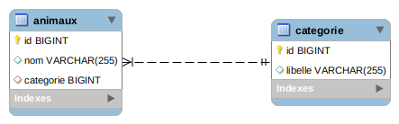

# hibernate-one-to-many

Dans ce projet, on veut représenter les données suivantes :
[data](data.csv)

On va donc implémenter deux tables et une relation one-to-many :

#### Spring/hibernate

On va réaliser uniquement les controllers de base du backend. Grâce à la dépéndance `org.springframework.boot:spring-boot-starter-data-rest`, les fonctions du repository seront directement exposées comme endpoints de l'application.

#### Postman

On peut tester les endpoints de l'application avec la collection suivante : 

#### Référence

<https://spring.io/guides/gs/accessing-data-rest/>